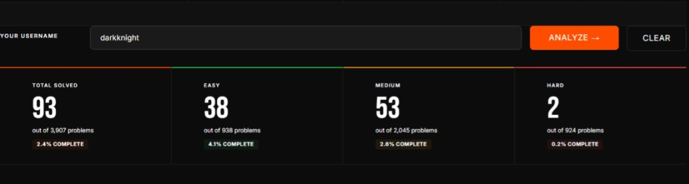
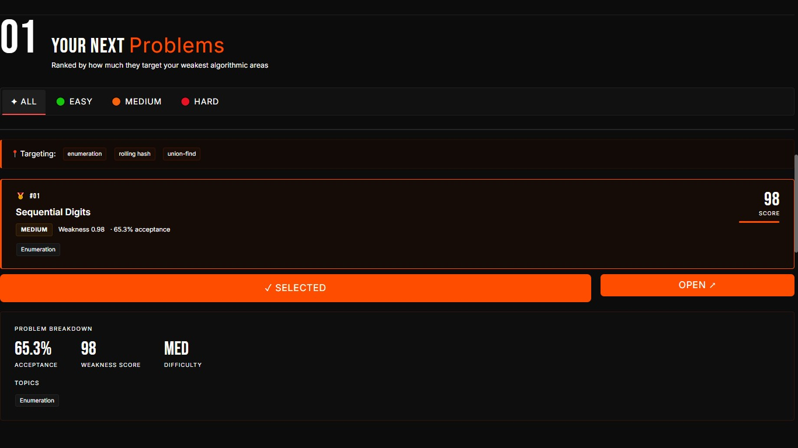
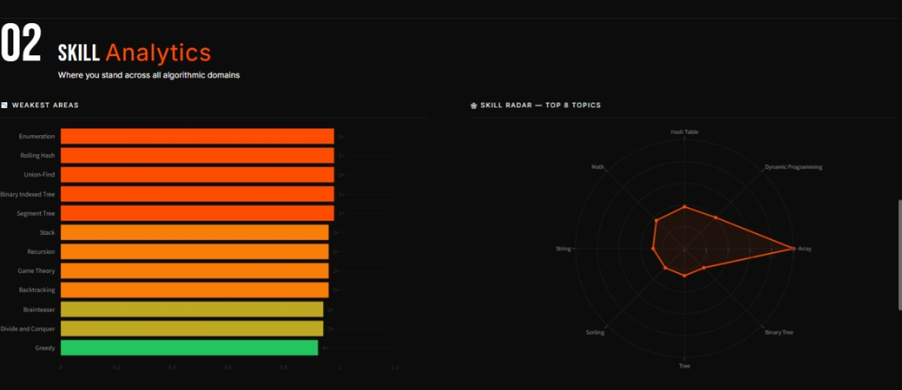
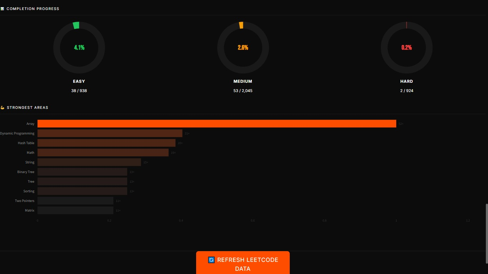

<div align="center">

# ⚡ LeetCode Recommender

**Stop grinding blindly. Target your exact weak spots.**

An intelligent, multi-user system that analyses any LeetCode profile and recommends the most impactful problem to solve next — backed by real data, not guesswork.

[](https://python.org)
[](https://fastapi.tiangolo.com)
[](https://streamlit.io)
[](LICENSE)


[Live Demo](#) · [Report Bug] · [Request Feature]

</div>

---

## 📌 What It Does

Enter **any** LeetCode username and instantly get:

- 🎯 **Top ranked problem recommendation** targeting your exact skill gaps
- 📊 **Weakness map** — every tag scored from 0.0 (strongest) to 1.0 (weakest)
- 📈 **Progress tracker** — Easy / Medium / Hard solved out of total
- 🕸 **Skill radar** — visual snapshot across your top 8 practiced topics
- 🔄 **One-click refresh** — re-fetch your latest LeetCode data anytime

No login required on the dashboard. Just type a username and go.

---

## 🖼 Screenshots

> Dashboard, stat cards, recommendation cards, and analytics charts.
> 
> 
> 
> 
> 
  
  
> 
> 

---

## 🏗 Architecture

```
leetcode-recommender/
├── api/
│   ├── main.py              # FastAPI app — loads 3000+ problems at startup
│   ├── routes.py            # /recommend /stats /update endpoints
│   ├── schemas.py           # Pydantic response models
│   └── user_pipeline.py     # Per-user ETL + 10-min in-memory cache
│
├── scraper/
│   ├── fetch_profile.py     # LeetCode GraphQL API integration
│   ├── parse_submissions.py # Raw JSON → clean structured data
│   └── tag_analyzer.py      # Weakness / strength scoring engine
│
├── model/
│   ├── weakness_scorer.py   # Scores problems against user's weakness map
│   ├── problem_ranker.py    # Ranks 3000+ unsolved problems per user
│   └── train.py             # Generates model.pkl (optional offline mode)
│
├── dashboard.py             # Streamlit frontend — mobile responsive
├── config.py                # Single place to read .env credentials
├── requirements.txt         # Pinned dependencies
├── .python-version          # Pins Python 3.11.9 for Render
└── .env                     # Your credentials — never committed to Git
```

### How a request flows

```
User types username in browser
        ↓
Streamlit calls  GET /recommend?username=X
        ↓
user_pipeline.run_pipeline()
   ├─ Cache hit (< 10 min)?  →  return instantly
   └─ Cache miss?
        ├─ Fetch profile via LeetCode GraphQL
        ├─ Parse & normalize tag data
        ├─ Compute weakness scores per tag
        └─ Rank 3000+ unsolved problems
                ↓
        JSON response → Dashboard renders UI
```

---

## ⚙️ Algorithm

### Step 1 — Tag weakness scoring

```
strength_score = problems_solved_in_tag / max_solved_in_any_single_tag
weakness_score = 1 - strength_score       (0.0 = strongest, 1.0 = never touched)
```

### Step 2 — Problem ranking

```
problem_score = average(weakness_score of all tags on that problem)
```

Every unsolved problem is scored and sorted. The top result = the problem most targeted at your blind spots.

### Step 3 — Caching

- **Problem catalog** (3000+ problems) — fetched once at startup, shared for all users.
- **Per-user results** — cached 10 minutes. Repeated requests return instantly.

---

## 🚀 Running Locally

### Prerequisites

- Python 3.11+
- A LeetCode account
- Your LeetCode session cookie (see below)

### 1. Clone and install

```bash
git clone https://github.com/Reena1912/leetcode-recommender.git
cd leetcode-recommender

python -m venv venv
source venv/bin/activate        # Windows: venv\Scripts\activate

pip install -r requirements.txt
```

### 2. Get your session cookie

1. Log into [leetcode.com](https://leetcode.com)
2. Open DevTools → `F12` → **Application** → **Cookies** → `https://leetcode.com`
3. Copy the value of **`LEETCODE_SESSION`**

### 3. Create `.env`

```env
LEETCODE_SESSION=paste_your_session_cookie_here
LEETCODE_USERNAME=your_leetcode_username
```

> `.env` is in `.gitignore` — it will never be committed.

### 4. Start the API

```bash
uvicorn api.main:app --reload --reload-dir api
```

Wait for this before opening the app:

```
✓ 3000+ problems loaded
INFO:     Application startup complete.
```

This takes ~30 seconds on first run — the server fetches the full problem catalog.

### 5. Start the dashboard

Open a second terminal:

```bash
streamlit run dashboard.py
```

Open [http://localhost:8501](http://localhost:8501), type any LeetCode username, click **Go →**.

---

## 🔌 API Reference

All endpoints accept `?username=<leetcode_username>`. If omitted, falls back to `LEETCODE_USERNAME` in `.env`.

| Method | Endpoint | Description |
|--------|----------|-------------|
| `GET` | `/` | API info and endpoint listing |
| `GET` | `/recommend?username=X` | Top recommendation, any difficulty |
| `GET` | `/recommend/easy?username=X` | Top Easy recommendation |
| `GET` | `/recommend/medium?username=X` | Top Medium recommendation |
| `GET` | `/recommend/hard?username=X` | Top Hard recommendation |
| `GET` | `/stats?username=X` | Tag scores, solve counts, totals |
| `POST` | `/update?username=X` | Force-refresh data for a user |
| `GET` | `/docs` | Swagger interactive docs |

### Sample response — `/recommend?username=neal_wu`

```json
{
  "recommendation": {
    "title": "Burst Balloons",
    "titleSlug": "burst-balloons",
    "difficulty": "Hard",
    "acceptance_rate": 58.3,
    "tags": ["Array", "Dynamic Programming", "Divide and Conquer"],
    "weakness_score": 0.87,
    "leetcode_url": "https://leetcode.com/problems/burst-balloons/"
  },
  "your_weakest_tags": ["Divide and Conquer", "Segment Tree", "Trie"],
  "message": "Based on neal_wu's weak areas, start with this Hard problem."
}
```

---


## 📁 Key Files

| File | What it does |
|------|-------------|
| `api/user_pipeline.py` | Orchestrates the full ETL for any username. Manages TTL cache. |
| `api/routes.py` | All HTTP endpoints. Every route accepts `?username=` for multi-user support. |
| `scraper/fetch_profile.py` | Pure functions — `fetch_user_profile_data(username, cookie)`. No side effects, no file writes. |
| `scraper/tag_analyzer.py` | `compute_tag_scores(tags)` — pure function. Input: tag list. Output: sorted weakness scores. |
| `model/weakness_scorer.py` | Scores a problem by averaging weakness scores across its tags. Unknown tags default to `0.5`. |
| `dashboard.py` | Streamlit frontend. Username in session state. All API calls pass `?username=`. |
| `config.py` | Only file that reads `.env`. All other files import from here. |
| `.python-version` | Pins Python 3.11.9 on Render. Required — do not delete. |

---

## 🛠 Tech Stack

| Layer | Technology |
|-------|-----------|
| Frontend | Streamlit + Plotly + Custom CSS (Bebas Neue, Inter) |
| Backend | FastAPI + Uvicorn |
| Data source | LeetCode GraphQL API |
| Caching | In-process dict with 10-min TTL |
| Validation | Pydantic v2 |
| Hosting | Render (two Web Services) |

---

## 📈 Roadmap

- [ ] Spaced repetition — resurface weak tags untouched for 14+ days
- [ ] Daily challenge mode — one problem per day + streak counter
- [ ] Friend comparison — side-by-side radar for two usernames
- [ ] AI study plan — day-by-day plan from weakness map + interview date
- [ ] Contest rating graph
- [ ] GitHub-style solve heatmap calendar

---

## 📄 License

MIT — free for personal use, portfolios, and commercial projects.

---

## 👩‍💻 Author

**Reena K**

[](https://github.com/Reena1912)
[](https://www.linkedin.com/in/k-reena-0aa37b244/)

---

<div align="center">
  <sub>Built with ⚡ · LeetCode GraphQL API · Weakness-score ranking · Mobile ready</sub>
</div>
